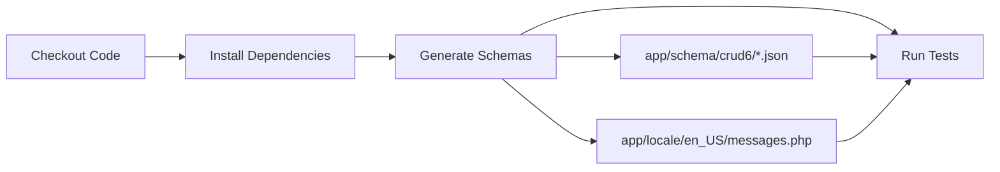

# Schema Generation Approach for CRUD6 Tests

## Overview

CRUD6 test schemas and translations are now **programmatically generated** using the SchemaBuilder helper instead of being copied from example files. This ensures schemas stay in sync with code changes as the project evolves.

## How It Works

### 1. Schema Generation Script

The script `generate-test-schemas.php` uses the SchemaBuilder to create:
- **Schema JSON files** in `app/schema/crud6/`
- **Translation files** in `app/locale/en_US/messages.php`

### 2. CI/CD Integration

The GitHub Actions workflow automatically runs the generation script before tests:

```yaml
- name: Generate CRUD6 Schema Files and Translations
  run: php generate-test-schemas.php
```

This eliminates the need to copy files from `examples/` during CI.

### 3. Example Files (Reference Only)

Files in `examples/schema/` and `examples/locale/` are **kept for reference** but are not used by tests. They serve as:
- Documentation of schema structure
- Examples for developers
- Reference implementations

## File Structure

```
sprinkle-crud6/
├── generate-test-schemas.php          # Generation script (run this)
├── app/
│   ├── schema/crud6/                  # Generated schemas (git-ignored)
│   │   ├── users.json
│   │   ├── groups.json
│   │   ├── products.json
│   │   ├── roles.json
│   │   ├── permissions.json
│   │   └── activities.json
│   ├── locale/en_US/                  # Generated translations (git-ignored)
│   │   └── messages.php
│   └── tests/Testing/
│       ├── SchemaBuilder.php          # Schema builder helper
│       └── GenerateSchemas.php        # Generation logic
└── examples/                           # Reference files (kept for documentation)
    ├── schema/
    │   └── *.json
    └── locale/en_US/
        └── messages.php
```

## Usage

### Generate Schemas Locally

```bash
# From repository root
php generate-test-schemas.php
```

This creates:
- `app/schema/crud6/*.json` - Schema files for testing
- `app/locale/en_US/messages.php` - Translation keys

### Modify Schema Definitions

To change test schemas, edit `app/tests/Testing/GenerateSchemas.php`:

```php
private static function getSchemaDefinitions(): array
{
    return [
        'users' => fn() => SchemaBuilder::userSchema(),
        'groups' => fn() => SchemaBuilder::groupSchema(),
        'products' => fn() => SchemaBuilder::productSchema(),
        'roles' => fn() => self::rolesSchema(),
        'permissions' => fn() => self::permissionsSchema(),
        'activities' => fn() => self::activitiesSchema(),
    ];
}
```

Then regenerate:
```bash
php generate-test-schemas.php
```

### Add New Test Schema

1. Add a new schema method in `GenerateSchemas.php`:

```php
private static function myModelSchema(): array
{
    return SchemaBuilder::create('my_model', 'my_table')
        ->addStringField('name', required: true, listable: true)
        ->addPermissions(['read' => 'uri_my_model'])
        ->build();
}
```

2. Register it in `getSchemaDefinitions()`:

```php
'my_model' => fn() => self::myModelSchema(),
```

3. Regenerate:

```bash
php generate-test-schemas.php
```

## Benefits

### ✅ Type Safety
- IDE autocompletion catches errors
- Type hints prevent mistakes

### ✅ Maintainability
- Schema changes are code-based
- Easy to track in version control
- Clear diff reviews

### ✅ Consistency
- Enforces schema structure
- Prevents schema drift
- Standardized field definitions

### ✅ Automation
- CI automatically generates schemas
- No manual copying required
- Reduces human error

### ✅ Flexibility
- Easy to create test variations
- Programmatic field generation
- Conditional schema features

## Migration from Copy Approach

### Before (Old Approach)
```yaml
# CI copied files from examples/
- name: Copy CRUD6 Schema Files
  run: |
    cp examples/schema/*.json app/schema/crud6/
    # Merge translations...
```

**Problems:**
- Manual file maintenance
- Copy/paste errors
- Schema drift between examples and tests
- Merge conflicts in CI

### After (New Approach)
```yaml
# CI generates files programmatically
- name: Generate CRUD6 Schema Files and Translations
  run: php generate-test-schemas.php
```

**Benefits:**
- Automatic generation
- Type-safe definitions
- Single source of truth
- No merge conflicts

## Development Workflow

### 1. Develop with SchemaBuilder

Create schemas programmatically in tests:

```php
$schema = SchemaBuilder::create('test_model', 'test_table')
    ->addStringField('name', required: true)
    ->addPermissions(['create' => 'create_test'])
    ->build();
```

### 2. Standardize for Testing

Move commonly used schemas to `GenerateSchemas.php`:

```php
private static function testModelSchema(): array
{
    return SchemaBuilder::create('test_model', 'test_table')
        ->addStringField('name', required: true)
        ->addPermissions(['create' => 'create_test'])
        ->build();
}
```

### 3. Regenerate Test Fixtures

```bash
php generate-test-schemas.php
```

### 4. Run Tests

```bash
vendor/bin/phpunit
```

## CI/CD Pipeline



## Troubleshooting

### Schemas Not Generated

Check that the script runs successfully:
```bash
php generate-test-schemas.php
```

Look for output:
```
========================================
Generating CRUD6 Schemas and Translations
========================================

Generating schema files:
------------------------
✅ Generated: users.json
✅ Generated: groups.json
...
```

### Translation Errors

Verify the generated translations file:
```bash
php -l app/locale/en_US/messages.php
```

### Schema Validation Errors

Check JSON syntax:
```bash
php -r "json_decode(file_get_contents('app/schema/crud6/users.json'));"
```

## Future Enhancements

Potential improvements to the generation system:

1. **Schema Validation**: Add JSON schema validation before writing files
2. **Diff Detection**: Only regenerate changed schemas
3. **Custom Templates**: Support for custom schema templates
4. **Multi-Locale**: Generate translations for multiple locales
5. **Migration Generation**: Auto-generate database migrations from schemas

## Best Practices

### DO ✅
- Use SchemaBuilder for programmatic schema creation
- Regenerate schemas after schema logic changes
- Keep example files for documentation
- Version control the generator script
- Document custom schema methods

### DON'T ❌
- Manually edit generated JSON files
- Commit generated files to git (they should be in .gitignore)
- Copy schemas from examples to app/schema/crud6
- Skip regeneration after schema changes
- Hardcode translations in schemas

## Related Documentation

- `SchemaBuilder` class: `app/tests/Testing/SchemaBuilder.php`
- Usage guide: `.archive/SCHEMA_BUILDER_USAGE_GUIDE.md`
- Quick reference: `.archive/SCHEMA_BUILDER_QUICK_REFERENCE.md`
- CI workflow: `.github/workflows/unit-tests.yml`
